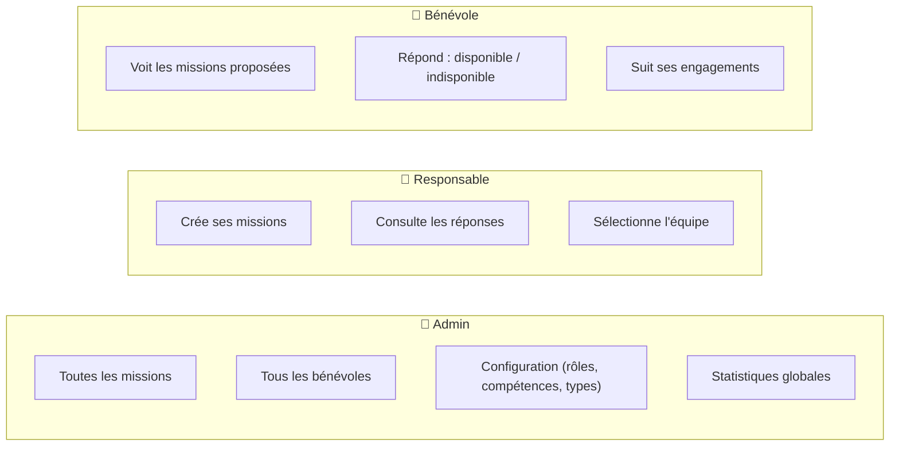
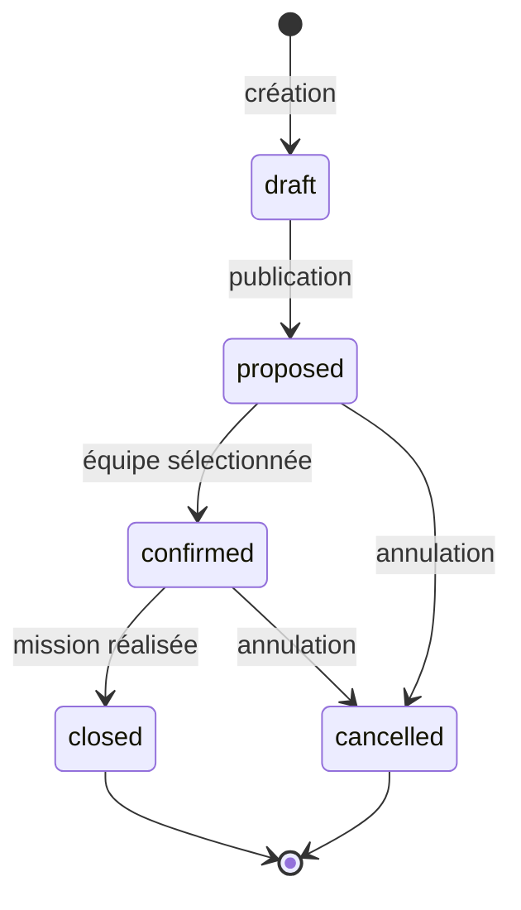
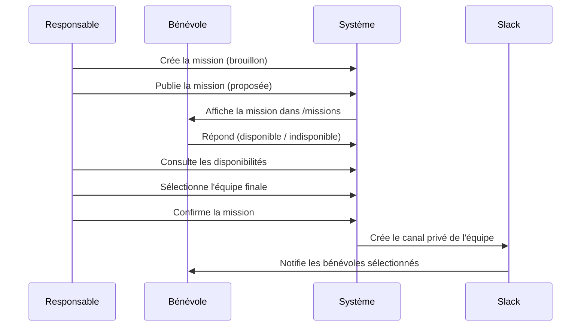

# Timeline

Application web de gestion des missions de protection civile. Elle couvre le cycle complet : proposition de mission, réponse des bénévoles, sélection de l'équipe finale, suivi des missions retenues, et intégration Slack.

**Stack** : Next.js 14 · TypeScript · Supabase (PostgreSQL + Auth + RLS) · Tailwind CSS · Playwright

---

## Vue d'ensemble

Timeline remplace la coordination manuelle des missions de bénévoles (appels, e-mails, tableurs) par une application centralisée où chaque rôle ne voit et n'agit que sur ce qui le concerne.

### Les rôles et leur périmètre



### Cycle de vie d'une mission



### Du besoin à la mission Slack



### En images

| Bénévole : liste des missions proposées | Responsable : détail d'une mission (réponses + sélection) |
|---|---|
|  |  |

| Bénévole : suivi de ses engagements | Admin : gestion des bénévoles |
|---|---|
|  |  |

---

## Sommaire

1. [Fonctionnalités](#fonctionnalités)
2. [Prérequis](#prérequis)
3. [Installation depuis zéro](#installation-depuis-zéro)
4. [Variables d'environnement](#variables-denvironnement)
5. [Base de données locale](#base-de-données-locale)
6. [Comptes de test](#comptes-de-test)
7. [Lancer l'application](#lancer-lapplication)
8. [Parcours de test](#parcours-de-test)
9. [Scripts disponibles](#scripts-disponibles)
10. [Architecture](#architecture)
11. [Intégration Slack](#intégration-slack)
12. [Tests](#tests)
13. [Déploiement](#déploiement)
14. [Limites connues](#limites-connues)
15. [Licence](#licence)

Pour contribuer (branches, PR, environnements), voir [`CONTRIBUTING.md`](./CONTRIBUTING.md).

---

## Fonctionnalités

### Rôles utilisateurs

| Rôle | Accès |
|---|---|
| `admin` | Vision globale : tous les bénévoles, toutes les missions, toutes les propositions |
| `responsable` | Gestion stricte des missions dont il est responsable |
| `benevole` | Consultation des missions proposées, réponse aux propositions, suivi de ses missions retenues |

### Fonctionnalités disponibles

- Authentification et profils par rôle.
- Consultation des missions avec filtres (catégorie, dates, compétences requises).
- Réponses bénévoles : `disponible`, `indisponible`, `peut-être`.
- Validation responsable/admin des propositions (`acceptée`, `refusée`).
- Sélection et retrait de bénévoles pour l'équipe finale.
- Vue bénévole des missions retenues (`/my-missions`).
- Historique métier par mission (création, changement de statut, réponses, sélections/retraits d'équipe).
- Système de compétences et de rôles avec règles de visibilité configurable.
- Import de missions depuis Google Sheets.
- Intégration Slack V1 (bot : création canal privé, invitations, messages DM).
- Auth Slack V2 (OpenID Connect SSO + liaison de compte OAuth).
- Types de missions configurables avec compétences requises par défaut.

---

## Prérequis

Avant de commencer, vérifier que les outils suivants sont installés :

| Outil | Version minimale | Vérification |
|---|---|---|
| [Node.js](https://nodejs.org) | 20+ | `node -v` |
| [npm](https://npmjs.com) | 10+ | `npm -v` |
| [Docker](https://docs.docker.com/get-docker/) | récent | `docker -v` |
| [Supabase CLI](https://supabase.com/docs/guides/cli) | récent | `supabase -v` |
| [Git](https://git-scm.com) | récent | `git -v` |

Installer Supabase CLI via npm si nécessaire :

```bash
npm install -g supabase
```

---

## Installation depuis zéro

### 1. Cloner le dépôt

```bash
git clone https://github.com/ggenelot/timeline.git
cd timeline
```

### 2. Installer les dépendances Node

```bash
npm install
```

### 3. Créer le fichier d'environnement local

```bash
cp .env.example .env.local
```

Ouvrir `.env.local` et renseigner les variables (voir [Variables d'environnement](#variables-denvironnement) ci-dessous).

### 4. Démarrer Supabase en local

Docker doit être lancé. Supabase démarre une instance PostgreSQL locale, le studio d'administration, et les services Auth.

```bash
npm run supabase:start
```

À la fin de la commande, les URLs et clés locales sont affichées dans le terminal. Copier :

- `API URL` → `NEXT_PUBLIC_SUPABASE_URL`
- `anon key` → `NEXT_PUBLIC_SUPABASE_ANON_KEY`
- `service_role key` → `SUPABASE_SERVICE_ROLE_KEY`

Et les coller dans `.env.local`.

### 5. Appliquer les migrations de base de données

```bash
npm run supabase:db:push
```

Cette commande applique toutes les migrations du dossier `supabase/migrations/` dans l'ordre chronologique.

### 6. Créer les comptes de test

```bash
npm run demo:create-test-accounts
```

Crée (de façon idempotente) les 5 comptes `auth.users` fixes utilisés par les tests E2E et les captures d'écran de démo, mot de passe `protec1234` (configurable via `E2E_TEST_PASSWORD`) :

| Email | Rôle applicatif |
|---|---|
| `admin@pcivile.test` | Admin |
| `responsable@pcivile.test` | Responsable |
| `benevole@pcivile.test` | Bénévole |
| `benevole2@pcivile.test` | Bénévole |
| `benevole3@pcivile.test` | Bénévole |

Relancer ce script est sans danger : les comptes déjà existants sont simplement réinitialisés sur ce mot de passe. Les rôles applicatifs sont ensuite assignés via les seeds (étape suivante).

### 7. Charger les données de seed

```bash
npm run supabase:db:seed
```

Le seed insère :

- Missions avec statuts variés (`proposed`, `closed`, `cancelled`, `confirmed`).
- Propositions avec statuts et réponses différents.
- Affectations d'équipe existantes.
- Compétences de profil et compétences requises par mission.
- Types de missions par défaut (Maraude, Garde, Formation, Vie d'antenne, Poste de secours).
- Événements d'historique initiaux.

### 7bis. Peupler la base avec des données de démo (optionnel)

Pour voir tout de suite le potentiel de l'application (beaucoup de bénévoles, de missions variées, de cursus en cours...), un script génère automatiquement un jeu de données riche, en plus des 5 comptes fixes ci-dessus :

```bash
npm run db:seed:demo
```

Ce script crée (idempotent — relancer ne duplique pas les données) :

- ~36 comptes (`auth.users` + profils) répartis admin / responsable / bénévole, avec emails `demo-*@timeline.demo` et le même mot de passe `protec1234`.
- Des compétences et niveaux de progression variés par bénévole.
- ~25 missions couvrant tous les statuts, types et plages de dates (passées et futures).
- Des propositions et affectations d'équipe réalistes sur ces missions.
- Des inscriptions aux cursus CE/CP/CEPS avec doublures et compétences partiellement validées.

Par sécurité, le script refuse de s'exécuter si `NEXT_PUBLIC_SUPABASE_URL` ne ressemble pas à une instance locale (`127.0.0.1`/`localhost`). Pour forcer l'exécution sur un autre projet (déconseillé sur un projet de production), ajouter `--force` :

```bash
npm run db:seed:demo -- --force
```

Pour repartir d'une base propre : `npm run supabase:db:reset` puis relancer le script.

> Astuce : `npm run demo:setup` enchaîne `supabase:db:reset`, `demo:create-test-accounts`, `supabase:db:seed` et `db:seed:demo` en une seule commande.

### 7ter. Régénérer les captures d'écran de démo (optionnel)

Une fois l'application lancée (étape suivante) et les comptes de test créés, les 4 captures d'écran de la section [Vue d'ensemble](#vue-densemble) peuvent être régénérées automatiquement :

```bash
npm run demo:screenshots
```

Le script se connecte avec chaque rôle (`admin`, `responsable`, `bénévole`) et capture les vues illustrées dans ce README, en écrasant les fichiers dans `docs/images/`. À relancer après un changement d'UI notable pour garder les captures à jour, sans étape manuelle.

### 8. Lancer le serveur de développement

```bash
npm run dev
```

L'application est accessible sur **http://localhost:3000**.

---

## Variables d'environnement

Le fichier `.env.example` contient toutes les variables avec leur description. Voici un récapitulatif par catégorie.

### Variables obligatoires

| Variable | Description |
|---|---|
| `NEXT_PUBLIC_SUPABASE_URL` | URL publique du projet Supabase (ex. `https://xyz.supabase.co` ou `http://127.0.0.1:54321` en local) |
| `NEXT_PUBLIC_SUPABASE_ANON_KEY` | Clé publique Supabase (safe à exposer côté client) |
| `SUPABASE_SERVICE_ROLE_KEY` | Clé de service Supabase (accès admin complet — **ne jamais exposer côté client**) |
| `APP_BASE_URL` | URL de base de l'application (ex. `http://localhost:3000` ou `https://monapp.vercel.app`) |

### Variables Slack (optionnelles)

L'application fonctionne sans Slack. Ces variables sont requises uniquement si l'intégration Slack est activée.

| Variable | Description |
|---|---|
| `SLACK_BOT_TOKEN` | Token du bot Slack (`xoxb-...`), pour les opérations missions (canal privé, invitations, DMs) |
| `SLACK_SIGNING_SECRET` | Secret de signature Slack, pour vérifier les slash commands |
| `SLACK_CLIENT_ID` | ID client OAuth Slack |
| `SLACK_CLIENT_SECRET` | Secret client OAuth Slack |
| `SLACK_OAUTH_REDIRECT_URI` | URI de callback pour la liaison de compte (ex. `http://localhost:3000/api/slack/connect/callback`) |
| `SLACK_AUTH_REDIRECT_URI` | URI de callback pour la connexion SSO (ex. `http://localhost:3000/api/auth/slack/callback`) |
| `SLACK_TEAM_ID` | ID du workspace Slack (optionnel, restreint la connexion à un seul workspace) |
| `SLACK_TEAM_DOMAIN` | Domaine du workspace Slack (optionnel, utilisé pour les redirections) |

### Variables de test (optionnelles)

| Variable | Description |
|---|---|
| `E2E_BASE_URL` | URL de base pour les tests E2E (par défaut : `APP_BASE_URL` ou `http://localhost:3000`) |
| `E2E_TEST_PASSWORD` | Mot de passe des comptes de test E2E (par défaut : `protec1234`) |
| `SLACK_TEST_EMAIL` | Email du compte Slack utilisé dans les tests SSO |
| `SLACK_TEST_PASSWORD` | Mot de passe du compte Slack de test |
| `SLACK_TEST_WORKSPACE_URL` | URL du workspace Slack de test |
| `GOOGLE_MISSIONS_SHEET_PUBLIC_URL` | URL publique d'un Google Sheet pour l'import de missions |

---

## Base de données locale

### Commandes utiles

```bash
# Démarrer l'instance Supabase locale (Docker requis)
npm run supabase:start

# Arrêter l'instance
npm run supabase:stop

# Remettre la base à zéro (supprime toutes les données)
npm run supabase:db:reset

# Appliquer les migrations (sans reset)
npm run supabase:db:push

# Charger les seeds
npm run supabase:db:seed

# Créer un nouveau fichier de migration (préfixé automatiquement avec un timestamp)
npm run supabase:migration:new nom_de_la_migration
```

### Studio local

L'interface graphique Supabase est disponible sur **http://localhost:54323** pendant que l'instance locale tourne.

### Structure des migrations

Les migrations se trouvent dans `supabase/migrations/` et sont appliquées dans l'ordre chronologique des timestamps. Les migrations couvrent :

- Phase 1 : Base (profils, missions, RLS)
- Phase 2 : Propositions de missions
- Phase 3 : Workflow de mission
- Phase 4 : Affectations
- Phase 5 : Compétences et filtres
- Phase 6 : Historique et gardes métier
- Phase 7+ : Intégration Slack, rôles avancés, types de missions, visibilité

> **Règle critique** : Ne jamais modifier manuellement les fichiers de migration existants ni éditer directement la table `schema_migrations` en base. Voir `AGENTS.md` pour les règles complètes.

---

## Comptes de test

| Email | Mot de passe | Rôle | Ce qu'il peut faire |
|---|---|---|---|
| `admin@pcivile.test` | `protec1234` | Admin | Tout voir et tout faire |
| `responsable@pcivile.test` | `protec1234` | Responsable | Gérer ses missions, valider les propositions |
| `benevole@pcivile.test` | `protec1234` | Bénévole | Répondre aux missions proposées, voir ses missions retenues |
| `benevole2@pcivile.test` | `protec1234` | Bénévole | Idem |
| `benevole3@pcivile.test` | `protec1234` | Bénévole | Idem |

Ce sont les comptes stables utilisés par les tests E2E, provisionnés via `npm run demo:create-test-accounts` (voir [étape 6](#installation-depuis-zéro)). Si le script de démo (voir [étape 7bis](#installation-depuis-zéro)) a été exécuté, de nombreux autres comptes `demo-*@timeline.demo` existent également — pour les parcourir, utiliser Supabase Studio (Authentication → Users) ou la page `/admin/volunteers` de l'application.

---

## Lancer l'application

```bash
# Développement (hot reload)
npm run dev

# Build de production
npm run build

# Lancer la version buildée
npm start
```

---

## Parcours de test

### En tant que responsable

1. Se connecter avec `responsable@pcivile.test`.
2. Ouvrir `/missions`, tester les filtres (catégorie, dates, compétences).
3. Ouvrir une mission au statut `proposed`.
4. Sélectionner / retirer un bénévole de l'équipe.
5. Confirmer la mission.
6. Vérifier la section **Historique** sur la fiche mission.
7. Aller sur `/admin/proposals` et valider ou refuser une proposition.

### En tant que bénévole

1. Se connecter avec `benevole@pcivile.test`.
2. Répondre `disponible` sur une mission `proposed`.
3. Vérifier que les missions `closed` ou `confirmed` bloquent les modifications.
4. Ouvrir `/my-missions` et vérifier la liste des affectations retenues.

### En tant qu'admin

1. Se connecter avec `admin@pcivile.test`.
2. Accéder à `/admin/volunteers` pour voir tous les bénévoles.
3. Vérifier `/admin/gestion` pour la gestion globale des missions.
4. Vérifier l'accès aux compétences sur `/admin/competences`.
5. Si Slack configuré : tester le healthcheck sur `/api/admin/slack/health`.

---

## Scripts disponibles

```bash
# Application
npm run dev              # Serveur de développement (http://localhost:3000)
npm run build            # Build de production
npm start                # Serveur de production

# Qualité de code
npm run lint             # ESLint
npm run typecheck        # Vérification TypeScript

# Tests
npm test                 # typecheck + tests E2E P0
npm run test:e2e         # Tous les tests E2E (Playwright)
npm run test:e2e:p0      # Tests de régression P0 uniquement
npm run test:e2e:slack-sso  # Tests Slack SSO

# Supabase
npm run supabase:start          # Démarrer l'instance locale
npm run supabase:stop           # Arrêter l'instance locale
npm run supabase:db:reset       # Remettre la base à zéro
npm run supabase:db:push        # Appliquer les migrations
npm run supabase:db:seed        # Charger les seeds
npm run supabase:migration:new  # Créer une migration
npm run db:seed:demo            # Peupler la base avec des données de démo riches (comptes, missions, cursus)

# Démo / captures d'écran
npm run demo:create-test-accounts  # Créer les 5 comptes de test fixes (idempotent)
npm run demo:setup                 # Reset complet + comptes de test + seeds + données de démo, en une commande
npm run demo:screenshots            # Régénérer les captures d'écran du README (app démarrée requise)

# Utilitaires
npm run diagnose:slack-oauth    # Diagnostiquer la configuration OAuth Slack
```

---

## Architecture

```
timeline/
├── app/                    # Pages et API routes (Next.js App Router)
│   ├── admin/              # Pages d'administration
│   ├── api/                # Endpoints API (auth, slack, missions…)
│   ├── missions/           # Liste et détail des missions
│   ├── my-missions/        # Missions retenues du bénévole connecté
│   ├── profile/            # Profil utilisateur
│   └── login/              # Page de connexion
├── components/             # Composants React réutilisables
├── lib/                    # Utilitaires et configuration
│   ├── slack/              # Service Slack (auth, OAuth, templates, bot)
│   ├── supabase/           # Clients Supabase (client-side + server-side)
│   └── types.ts            # Types TypeScript partagés
├── supabase/
│   ├── migrations/         # Migrations SQL (61 fichiers, ordre chronologique)
│   ├── functions/          # Edge Functions Deno (Slack)
│   └── seeds/              # Données de test
├── tests/e2e/              # Tests Playwright
├── docs/                   # Documentation complémentaire
└── scripts/                # Scripts utilitaires (diagnostic, sécurité)
```

### Modèle de données principal

| Table | Rôle |
|---|---|
| `profiles` | Profils utilisateurs avec rôle (`admin`, `responsable`, `benevole`) |
| `missions` | Missions avec statut, type, dates, équipe |
| `mission_proposals` | Réponses des bénévoles aux missions |
| `mission_assignments` | Équipe finale sélectionnée par mission |
| `mission_required_skills` | Compétences requises par mission |
| `skills` / `profile_skills` | Référentiel compétences + compétences utilisateur |
| `mission_types` | Types de missions configurables |
| `roles` / `profile_roles` | Rôles fonctionnels (distincts du rôle auth) |
| `role_behaviors` | Règles de comportement par rôle (visibilité, création, Slack) |
| `activity_logs` | Historique métier immuable (écrit par triggers SQL) |
| `slack_*` | Tables d'intégration Slack (identités, invitations, logs, templates) |

### Sécurité des données (RLS)

Toutes les tables sont protégées par des politiques Row-Level Security dans Supabase :

- **Bénévole** : accès strict à ses propres propositions/affectations et aux missions qui lui sont proposées.
- **Responsable** : accès aux missions dont il est responsable.
- **Admin** : accès global.
- **Historique** : lecture autorisée si l'utilisateur peut lire la mission associée.
- **Écriture de l'historique** désactivée côté client — les logs sont écrits uniquement par triggers SQL.

---

## Intégration Slack

### Vue d'ensemble

L'intégration Slack comprend deux composantes :

1. **V1 — Bot Slack** : actions mission (création de canal privé, invitation bénévoles, envoi de DMs).
2. **V2 — Auth Slack** : connexion SSO via OpenID Connect et liaison de compte OAuth.

L'application fonctionne entièrement sans Slack si les variables ne sont pas configurées.

### Scopes OAuth requis (bot)

```
chat:write       # Envoyer des messages
groups:write     # Créer des canaux privés
groups:read      # Lire les canaux privés
im:write         # Envoyer des DMs
users:read       # Lire les profils utilisateurs (pour invite/liaison)
```

### Endpoints Slack

| Endpoint | Méthode | Description |
|---|---|---|
| `/api/slack/connect/start` | POST | Initie le flux OAuth de liaison de compte |
| `/api/slack/connect/callback` | GET | Finalise la liaison et met à jour le profil |
| `/api/slack/connect` | DELETE | Délie le compte Slack |
| `/api/slack/commands` | POST | Gestionnaire des slash commands Slack |
| `/api/auth/slack/start` | POST | Initie la connexion SSO Slack |
| `/api/auth/slack/callback` | GET | Callback SSO Slack |
| `/api/auth/slack/otp` | POST | Génère un OTP |
| `/api/auth/slack/otp/verify` | POST | Vérifie l'OTP |
| `/api/auth/slack/signup` | POST | Inscription via Slack |
| `/api/admin/slack/health` | GET | Health check du bot Slack |

### Slash command

La commande `/timeline login` sur le workspace Slack envoie un lien de connexion one-time à l'utilisateur (valide 10 minutes). Requiert que `SLACK_SIGNING_SECRET` soit configuré.

### Sécurité Slack

- États OAuth à usage unique avec expiration.
- Magic links hashés à usage unique avec expiration.
- Signature Slack vérifiée sur tous les endpoints slash commands.
- Validation du workspace (`SLACK_TEAM_ID`) si configuré.

---

## Tests

### Tests E2E (Playwright)

Les tests tournent sur une instance locale de l'application. Supabase local doit être démarré.

```bash
# Tous les tests
npm run test:e2e

# Tests de régression P0 uniquement
npm run test:e2e:p0

# Tests Slack SSO
npm run test:e2e:slack-sso
```

Les artéfacts en cas d'échec (traces, screenshots, vidéos) sont sauvegardés dans `test-results/`.

### Vérification de type

```bash
npm run typecheck
```

### Audit sécurité (historique Git)

Avant d'ouvrir le dépôt publiquement, scanner l'historique Git pour détecter d'éventuels secrets committés :

```bash
./scripts/scan-secrets-history.sh
```

Le script retourne un code non-zéro en cas de correspondance à investiguer.

---

## Déploiement

Le projet utilise deux environnements : **staging** (intégration, branche `staging`) et **production** (branche `main`). Voir `AGENTS.md` § 7 pour le détail des workflows et des conventions de branches.

### Vercel (frontend)

1. Connecter le dépôt à un projet Vercel.
2. Configurer les variables d'environnement séparément par environnement Vercel :
   - **Production** (branche `main`) → pointe sur le projet Supabase de production.
   - **Preview** (branche `staging` + toutes les autres branches/PR) → pointe sur le projet Supabase staging.
3. Chaque push sur `main` déclenche un déploiement de production. Chaque push sur `staging` déclenche un déploiement sur une URL stable dédiée. Chaque PR génère en plus son propre Preview Deployment.

### Supabase (base de données)

Il existe deux projets Supabase distincts : un projet **staging** et un projet **production**. Les migrations sont d'abord validées sur staging, puis rejouées sur production lors de la promotion `staging → main`.

- Push sur `staging` → CI verte → `.github/workflows/supabase-staging.yml` applique les migrations sur le projet Supabase staging.
- Push sur `main` → CI verte → `.github/workflows/supabase-prod.yml` applique les migrations sur le projet Supabase production.

Variables GitHub Secrets requises pour la CI/CD :

| Secret | Description |
|---|---|
| `SUPABASE_ACCESS_TOKEN` | Token d'accès Supabase CLI (compte, partagé entre les deux projets) |
| `SUPABASE_DB_PASSWORD` | Mot de passe de la base de données de production |
| `SUPABASE_PROJECT_ID` | ID du projet Supabase de production |
| `STAGING_SUPABASE_DB_PASSWORD` | Mot de passe de la base de données staging |
| `STAGING_SUPABASE_PROJECT_ID` | ID du projet Supabase staging |

### Serveur auto-hébergé (Docker)

Pour héberger l'application sur son propre serveur (VPS, etc.) plutôt que sur Vercel, l'app Next.js peut être conteneurisée avec le `Dockerfile` et le `docker-compose.yml` fournis à la racine. La base de données reste **Supabase Cloud** (le même projet que pour Vercel/local) — il n'y a pas de conteneur Postgres, uniquement le frontend/les API routes.

**Prérequis** : Docker + Docker Compose installés sur le serveur, et un projet Supabase Cloud déjà créé (voir la sous-section précédente).

```bash
# Créer le fichier d'environnement (mêmes variables que .env.local, voir .env.example)
cp .env.example .env

# Builder l'image (les NEXT_PUBLIC_* sont passés en build args automatiquement)
docker compose build

# Démarrer le conteneur
docker compose up -d
```

L'application écoute sur `http://localhost:3000` (ou l'IP du serveur). Ce conteneur ne sert que du HTTP brut : pour exposer le site en HTTPS, le placer derrière un reverse proxy comme Caddy ou Nginx, par exemple avec Caddy :

```
votre-domaine.fr {
  reverse_proxy localhost:3000
}
```

**Mise à jour** : comme les variables `NEXT_PUBLIC_*` sont injectées au moment du build, un rebuild est nécessaire à chaque déploiement :

```bash
git pull && docker compose build && docker compose up -d
```

Les migrations de base de données restent indépendantes de Docker : elles s'appliquent toujours via `npx supabase db push` ou le workflow GitHub Actions `supabase-prod.yml` décrit ci-dessus.

### Checklist post-déploiement

- [ ] Connexion utilisateur fonctionnelle.
- [ ] Liste des missions et filtres OK.
- [ ] Réponse bénévole (disponible / indisponible / peut-être) OK.
- [ ] Validation admin des propositions OK.
- [ ] Mission confirmée visible dans `/my-missions`.
- [ ] Si Slack actif : healthcheck `/api/admin/slack/health` retourne `ok`.

---

## Limites connues

- Historique minimal : pas de diff fin, pas de versioning, pas de pagination avancée.
- Pas de notifications temps réel (email, push, SMS).
- Pas de calendrier avancé ni de gestion de conflits de planning.
- Interface back-office limitée pour la gestion fine des compétences.
- Validations métier concentrées sur les statuts globaux (simplification volontaire MVP).

---

## Licence

Ce projet est publié sous licence MIT. Voir le fichier `LICENSE`.
