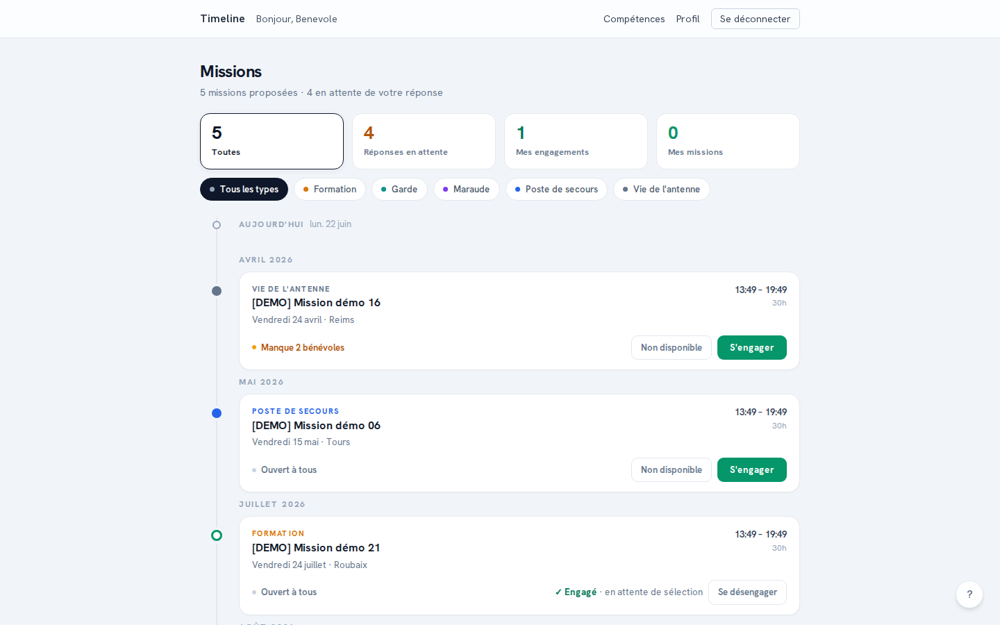
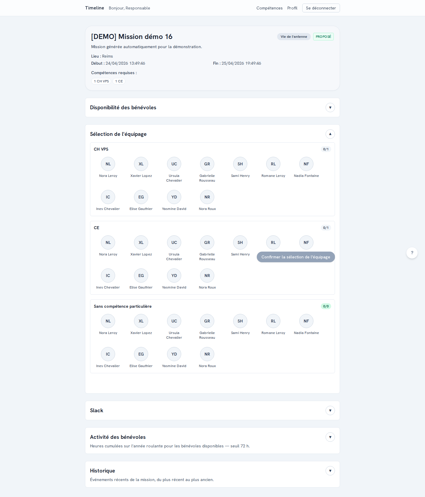
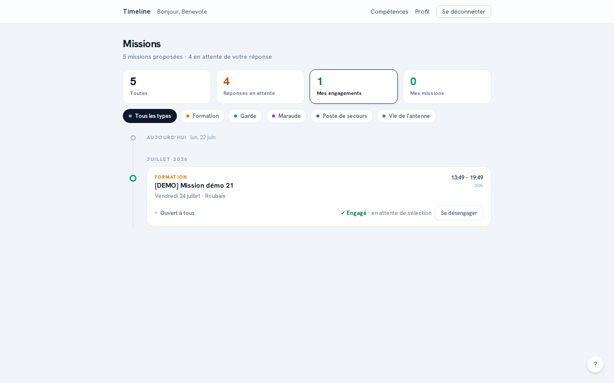
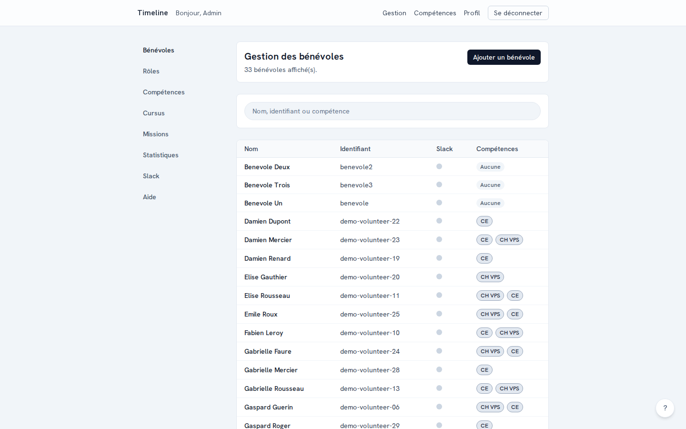
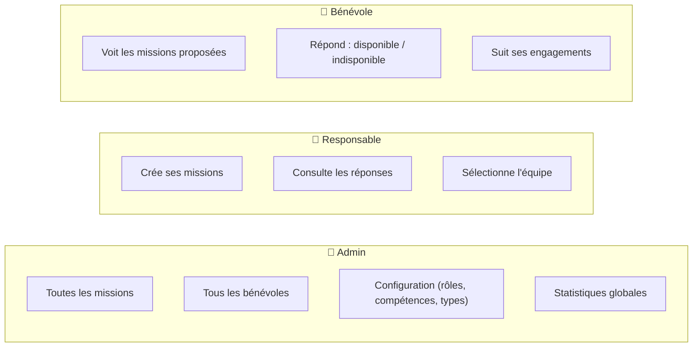

# Timeline

**Timeline coordonne les missions de bénévoles de protection civile**, du besoin exprimé jusqu'à l'équipe confirmée sur le terrain — fini les coordinations à coups d'appels, d'e-mails et de tableurs.

Un responsable publie une mission → les bénévoles concernés voient sa proposition et répondent (disponible / indisponible) → le responsable sélectionne son équipe → l'équipe est notifiée, sur Slack si votre organisation l'utilise. Chaque rôle ne voit et n'agit que sur ce qui le concerne.

**Stack** : Next.js 14 · TypeScript · Supabase (PostgreSQL + Auth + RLS) · Tailwind CSS · Playwright — open source, licence MIT, déployable en quelques minutes sur Vercel + Supabase.

---

## En images

| Bénévole : liste des missions proposées | Responsable : détail d'une mission (réponses + sélection) |
|---|---|
|  |  |

| Bénévole : suivi de ses engagements | Admin : gestion des bénévoles |
|---|---|
|  |  |

---

## Pour qui, et pourquoi

Toute association qui mobilise des bénévoles sur des missions ponctuelles (protection civile, secourisme, événementiel associatif...) et qui gère aujourd'hui ça par téléphone, e-mail ou tableur croisé avec un agenda partagé.

Timeline apporte :

- **Une seule source de vérité** pour qui est disponible, qui est affecté, et où en est chaque mission.
- **Moins de sollicitations inutiles** : un bénévole ne voit que les missions qui le concernent (compétences requises, disponibilités).
- **Une notification Slack automatique** dès qu'une équipe est confirmée (optionnel).
- **Un historique** de chaque décision prise sur une mission — qui a répondu quoi, qui a été sélectionné, quand.

### Les rôles et leur périmètre



---

## Fonctionnalités

**Missions & équipes** — publication et suivi des missions sur une frise chronologique filtrable, réponses des bénévoles (disponible / indisponible / peut-être), sélection de l'équipe finale, historique complet par mission, export calendrier (iCal), import de missions depuis Google Sheets, tableau de bord de pilotage opérationnel.

**Compétences & formation** — référentiel de compétences par bénévole, cursus de formation avec phases et validations (CE, CP, CEPS…), tableau de bord des compétences de l'équipe.

**Matériel** — catalogue de matériel et conteneurs, affectation aux missions et vérification assistée avant départ.

**Configuration** — types de missions réutilisables, rôles fonctionnels et permissions configurables, page d'aide personnalisable pour vos bénévoles.

**Slack (optionnel)** — création automatique du canal privé d'une mission, invitations et messages aux bénévoles sélectionnés, connexion SSO. L'application fonctionne entièrement sans Slack.

**eOPE (optionnel)** — synchronisation avec l'outil départemental de gestion des disponibilités : import des événements eOPE en missions et export des équipages engagés en engagements validés (voir [`docs/eope-api.md`](docs/eope-api.md)). L'application fonctionne entièrement sans eOPE.

Pour le détail complet fonctionnalité par fonctionnalité, voir le [guide de prise en main](docs/guide-prise-en-main.md).

---

## Déployer en production (Vercel + Supabase)

Ce guide part de zéro : ni projet Supabase, ni projet Vercel existants. Compter une dizaine de minutes.

### 1. Créer le projet Supabase

1. Créer un compte sur [supabase.com](https://supabase.com) puis **New project**.
2. Choisir une organisation, un nom, un mot de passe de base de données (à conserver précieusement) et une région.
3. Attendre la fin du provisioning (~2 minutes).
4. Dans **Project Settings → API**, noter : `Project URL`, `anon public key`, `service_role key` (secrète).

### 2. Créer le projet Vercel

1. Créer un compte sur [vercel.com](https://vercel.com) (connexion via GitHub recommandée).
2. **Add New… → Project**, puis importer votre fork (ou votre copie) du dépôt `timeline`.
3. Le framework Next.js est détecté automatiquement — ne pas déployer tout de suite, configurer d'abord les variables d'environnement ci-dessous.

### 3. Configurer les variables d'environnement

Dans **Project Settings → Environment Variables** du projet Vercel, ajouter (pour les environnements Production et Preview) :

| Variable | Valeur |
|---|---|
| `NEXT_PUBLIC_SUPABASE_URL` | `Project URL` récupérée à l'étape 1 |
| `NEXT_PUBLIC_SUPABASE_ANON_KEY` | `anon public key` récupérée à l'étape 1 |
| `SUPABASE_SERVICE_ROLE_KEY` | `service_role key` récupérée à l'étape 1 |
| `APP_BASE_URL` | laisser vide pour l'instant, à renseigner après le premier déploiement (étape 5) |

La liste complète des variables (dont celles pour Slack, optionnelles) est dans [`docs/INSTALLATION.md`](docs/INSTALLATION.md#variables-denvironnement).

### 4. Appliquer les migrations sur Supabase

Depuis votre poste, avec le [Supabase CLI](https://supabase.com/docs/guides/cli) installé (`npm install -g supabase`) :

```bash
supabase link --project-ref <reference-du-projet>   # Project Settings → General → Reference ID
supabase db push                                     # applique les migrations de supabase/migrations/
```

### 5. Déployer et finaliser l'URL

1. Dans Vercel, lancer le déploiement (**Deploy**, ou un push sur la branche connectée).
2. Une fois déployé, copier l'URL Vercel (ex. `https://mon-app.vercel.app`) et la renseigner dans la variable `APP_BASE_URL`.
3. Redéployer pour prendre en compte cette variable.

### 6. Créer le premier compte admin

1. Dans **Supabase Studio → Authentication → Users**, créer un utilisateur (email + mot de passe).
2. Dans **Table Editor → profiles**, repérer la ligne créée automatiquement pour cet utilisateur et mettre sa colonne `role` à `admin`.
3. Se connecter sur l'application déployée avec cet email.

### 7. (Optionnel) Activer Slack

L'application fonctionne très bien sans Slack. Pour l'activer, voir la section [Intégration Slack](docs/ARCHITECTURE.md#intégration-slack) de la documentation technique.

### Vérifier le déploiement

- [ ] Connexion utilisateur fonctionnelle.
- [ ] Liste des missions et filtres accessibles.
- [ ] Une mission de test peut être créée et une réponse bénévole enregistrée.
- [ ] Si Slack activé : `/api/admin/slack/health` retourne `ok`.

> Besoin d'un pipeline staging/production séparé, ou d'un hébergement auto-géré (Docker/VPS) plutôt que Vercel ? Voir [Déploiement avancé](docs/INSTALLATION.md#déploiement-avancé).

---

## Développement local

```bash
git clone https://github.com/ggenelot/timeline.git
cd timeline
npm install
cp .env.example .env.local        # renseigner les variables Supabase locales
npm run supabase:start            # démarre Supabase en local (Docker requis)
npm run supabase:db:push          # applique les migrations
npm run supabase:db:seed          # charge des données de test
npm run dev                       # http://localhost:3000
```

Guide pas à pas complet (comptes de test, données de démo, scripts, tests E2E) : [`docs/INSTALLATION.md`](docs/INSTALLATION.md).

---

## Documentation complémentaire

| Document | Contenu |
|---|---|
| [`docs/guide-prise-en-main.md`](docs/guide-prise-en-main.md) | Guide d'utilisation par rôle (bénévole, responsable, admin), en français simple |
| [`docs/INSTALLATION.md`](docs/INSTALLATION.md) | Installation locale détaillée, variables d'environnement, scripts, tests, déploiement avancé |
| [`docs/ARCHITECTURE.md`](docs/ARCHITECTURE.md) | Structure du projet, modèle de données, sécurité (RLS), intégration Slack technique |
| [`CONTRIBUTING.md`](CONTRIBUTING.md) | Workflow de contribution (branches, PR, environnements staging/production) |

---

## Limites connues

- Historique minimal : pas de diff fin, pas de versioning, pas de pagination avancée.
- Pas de notifications temps réel (email, push, SMS).
- Pas de calendrier avancé ni de gestion de conflits de planning.
- Interface back-office limitée pour la gestion fine des compétences.
- Validations métier concentrées sur les statuts globaux (simplification volontaire MVP).

---

## Licence

Ce projet est publié sous licence MIT. Voir le fichier [`LICENSE`](LICENSE).
