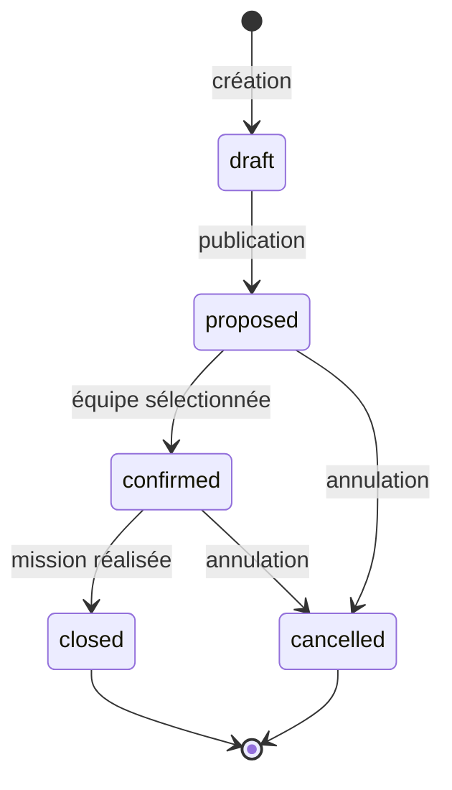
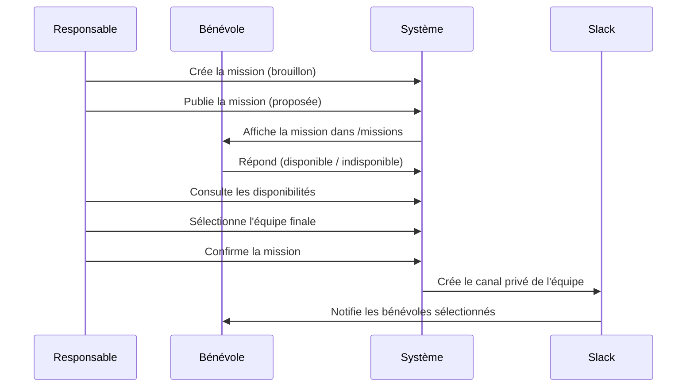

# Architecture technique — Timeline

Ce document détaille l'implémentation technique de Timeline : structure du code, modèle de données, sécurité et intégration Slack. Pour l'installation et le déploiement, voir [`docs/INSTALLATION.md`](./INSTALLATION.md). Pour une présentation générale du projet, voir le [`README.md`](../README.md) à la racine.

---

## Sommaire

1. [Structure du projet](#structure-du-projet)
2. [Diagrammes](#diagrammes)
3. [Modèle de données principal](#modèle-de-données-principal)
4. [Sécurité des données (RLS)](#sécurité-des-données-rls)
5. [Intégration Slack](#intégration-slack)

---

## Structure du projet

```
timeline/
├── app/                    # Pages et API routes (Next.js App Router)
│   ├── admin/              # Back-office : volunteers, missions, mission-types,
│   │                       #   skills, roles, materiels, cursus, ope-dashboard,
│   │                       #   competences-dashboard, stats, slack, help
│   ├── api/                # Endpoints API (auth, slack, missions, materiel,
│   │                       #   verification, ope-dashboard, calendar…)
│   ├── missions/           # Liste (frise) et détail des missions
│   ├── my-missions/        # Missions retenues du bénévole connecté
│   ├── competences/        # Compétences et cursus du bénévole
│   ├── verification/       # Vérification du matériel par mission
│   ├── profile/            # Profil utilisateur
│   └── login/              # Page de connexion
├── components/             # Composants React réutilisables
├── lib/                    # Utilitaires et configuration
│   ├── api/                # Helpers d'authentification API (auth, OPE)
│   ├── queries/            # Requêtes métier (cursus, activité)
│   ├── slack/              # Service Slack (auth, OAuth, templates, bot)
│   ├── supabase/           # Clients Supabase (client-side + server-side)
│   ├── missions.ts         # Logique missions
│   ├── import-missions.ts  # Import Google Sheets
│   ├── ope-dashboard.ts    # Agrégations du tableau de bord OPE
│   └── types.ts            # Types TypeScript partagés
├── supabase/
│   ├── migrations/         # Migrations SQL (ordre chronologique)
│   ├── functions/          # Edge Functions Deno (invitations & sync Slack)
│   └── seeds/              # Données de test (compétences…)
├── tests/e2e/              # Tests Playwright
├── docs/                   # Documentation complémentaire
└── scripts/                # Scripts utilitaires (diagnostic, démo, sécurité)
```

---

## Diagrammes

### Cycle de vie d'une mission



### Du besoin à la mission Slack



---

## Modèle de données principal

| Table | Rôle |
|---|---|
| `profiles` | Profils utilisateurs avec rôle (`admin`, `responsable`, `benevole`) |
| `missions` | Missions avec statut, type, dates, équipe |
| `mission_proposals` | Réponses des bénévoles aux missions |
| `mission_assignments` | Équipe finale sélectionnée par mission |
| `mission_required_skills` / `mission_required_levels` | Compétences et niveaux requis par mission |
| `mission_types` | Types de missions configurables (compétences/matériel par défaut) |
| `skills` / `profile_skills` | Référentiel compétences + compétences utilisateur |
| `skill_categories` / `skill_levels` / `skill_statuses` / `skill_domains` | Paramétrage du référentiel de compétences |
| `aptitudes` / `profile_aptitudes` | Aptitudes transverses et leur attribution aux bénévoles |
| `cursus` / `cursus_phases` / `cursus_rules` / `cursus_competences` | Définition des cursus de formation |
| `volunteer_cursus` / `doublures` / `competence_validations` | Inscriptions aux cursus, doublures (tutorat) et validations |
| `profile_domain_progress` | Progression des bénévoles par domaine |
| `materiel_types` / `materiel_categories` / `materiel_type_contents` | Catalogue de matériel et contenus de conteneurs |
| `materiel_instances` | Exemplaires de matériel avec statut et stockage |
| `mission_materiel_assignments` / `mission_required_materiels` | Matériel affecté / requis par mission |
| `mission_materiel_verifications` / `mission_materiel_verification_items` | Vérification du matériel par mission |
| `mission_visibility_rules` | Règles de visibilité des missions par rôle/compétence |
| `roles` / `profile_roles` | Rôles fonctionnels (distincts du rôle auth) |
| `role_behaviors` | Règles de comportement par rôle (visibilité, création, Slack) |
| `responsibilities` / `responsibility_holders` | Responsabilités fonctionnelles et leurs titulaires |
| `help_pages` / `events` | Contenu des pages d'aide et événements d'agenda |
| `activity_logs` | Historique métier immuable (écrit par triggers SQL) |
| `slack_*` | Tables d'intégration Slack (identités, invitations, logs, templates) |

Les migrations se trouvent dans `supabase/migrations/` et sont appliquées dans l'ordre chronologique des timestamps. Elles couvrent :

- Phase 1 : Base (profils, missions, RLS)
- Phase 2 : Propositions de missions
- Phase 3 : Workflow de mission
- Phase 4 : Affectations
- Phase 5 : Compétences et filtres
- Phase 6 : Historique et gardes métier
- Phase 7+ : Intégration Slack, rôles avancés, types de missions, visibilité

> **Règle critique** : Ne jamais modifier manuellement les fichiers de migration existants ni éditer directement la table `schema_migrations` en base. Voir `AGENTS.md` pour les règles complètes.

---

## Sécurité des données (RLS)

Toutes les tables sont protégées par des politiques Row-Level Security dans Supabase :

- **Bénévole** : accès strict à ses propres propositions/affectations et aux missions qui lui sont proposées.
- **Responsable** : accès aux missions dont il est responsable.
- **Admin** : accès global.
- **Historique** : lecture autorisée si l'utilisateur peut lire la mission associée.
- **Écriture de l'historique** désactivée côté client — les logs sont écrits uniquement par triggers SQL.

---

## Intégration Slack

### Vue d'ensemble

L'intégration Slack comprend deux composantes :

1. **V1 — Bot Slack** : actions mission (création de canal privé, invitation bénévoles, envoi de DMs).
2. **V2 — Auth Slack** : connexion SSO via OpenID Connect et liaison de compte OAuth.

L'application fonctionne entièrement sans Slack si les variables ne sont pas configurées.

### Scopes OAuth requis (bot)

```
chat:write       # Envoyer des messages
groups:write     # Créer des canaux privés
groups:read      # Lire les canaux privés
im:write         # Envoyer des DMs
users:read       # Lire les profils utilisateurs (pour invite/liaison)
```

### Endpoints Slack

| Endpoint | Méthode | Description |
|---|---|---|
| `/api/slack/connect/start` | POST | Initie le flux OAuth de liaison de compte |
| `/api/slack/connect/callback` | GET | Finalise la liaison et met à jour le profil |
| `/api/slack/connect` | DELETE | Délie le compte Slack |
| `/api/slack/commands` | POST | Gestionnaire des slash commands Slack |
| `/api/auth/slack/start` | POST | Initie la connexion SSO Slack |
| `/api/auth/slack/callback` | GET | Callback SSO Slack |
| `/api/auth/slack/otp` | POST | Génère un OTP |
| `/api/auth/slack/otp/verify` | POST | Vérifie l'OTP |
| `/api/auth/slack/signup` | POST | Inscription via Slack |
| `/api/admin/slack/health` | GET | Health check du bot Slack |

### Slash command

La commande `/timeline login` sur le workspace Slack envoie un lien de connexion one-time à l'utilisateur (valide 10 minutes). Requiert que `SLACK_SIGNING_SECRET` soit configuré.

### Sécurité Slack

- États OAuth à usage unique avec expiration.
- Magic links hashés à usage unique avec expiration.
- Signature Slack vérifiée sur tous les endpoints slash commands.
- Validation du workspace (`SLACK_TEAM_ID`) si configuré.

Pour la configuration détaillée des flux OAuth, voir [`docs/slack-oauth-flows.md`](./slack-oauth-flows.md) et [`docs/slack-auth.md`](./slack-auth.md).
